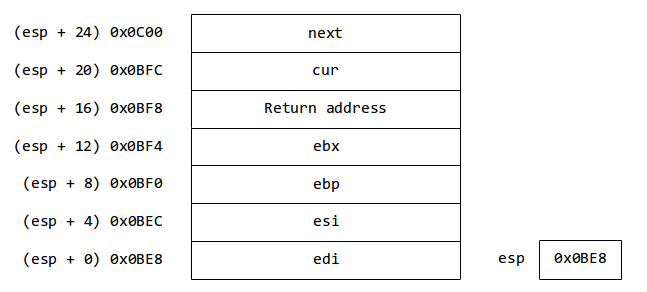

<dir dir="rtl" style="text-align: justify;">
# سیستم‌های عامل - تمرین گروهی دوم

## مشخصات گروه

>> نام، نام خانوادگی و ایمیل خود را در ادامه وارد کنید.

عرشیا اخوان <letmemakenewone@gmail.com>

محمدرضا عبدی <reza_abdi20@yahoo.com>

احمد سلیمی <ahsa9978@gmail.com> 

امیرمهدی نامجو <amirm137878@gmail.com> 

## مقدمه

>> اگر نکته‌ای درباره فایل‌های سابمیت شده یا برای TAها دارید، لطفا اینجا بیان کنید.

>> اگر از هر منبع برخط یا غیر برخطی به غیر از مستندات Pintos، متن درس، اسلایدهای درس یا نکات گفته شده در کلاس در تمرین گروهی استفاده کرده‌اید، لطفا اینجا آن(ها) را ذکر کنید.

## ساعت زنگ‌دار

### داده ساختارها

>> پرسش اول: تعریف `struct`های جدید، `struct`های تغییر داده شده، متغیرهای گلوبال یا استاتیک، `typedef`ها یا `enumeration`ها را در اینجا آورده و برای هریک در 25 کلمه یا کمتر توضیح بنویسید.

داده‌ساختار‌ها:

`sleepers`:
یک لیست مرتب شده از ریسه‌های خوابیده

`sleepers_lock`:
یک قفل برای امن‌ریسه کردن این لیست

<div dir="ltr">

```c
/* in timer.c */

static struct list sleepers;

static struct lock sleepers_lock;
```
</div>

`alarm_time`:
لحظه تعیین شده برای بیدار شدن ریسه، که از زمان بالا آمدن سیستم‌عامل محاسبه می‌شود.

`elem`:
برای اضافه کردن متغیر‌های
`alarm_time`
 به لیست
`sleepers`
 مورد نیاز است.

<div dir="ltr">

```c
/* in thread.c */

struct thread {
	...
	/* Shared between thread.c, synch.c, and timer.c. */
	struct list_elem elem; /* List element. */

	/* Owned by timer.c. */
	int64_t alarm_time;	/* Detects when a thread should wake up. */
	...
};

/* This function needs to be modified to initialize the new struct fields */
static void init_thread (struct thread *t, const char *name, int priority);
```
</div>

### الگوریتم

>> پرسش دوم: به اختصار آن‌چه هنگام صدا زدن تابع `timer_sleep()` رخ می‌دهد و همچنین اثر `timer interrupt handler` را توضیح دهید.

هنگام صدا زدن تابع 
`timer_sleep()`:

1. متغیر 
`alarm_time`
مقدار‌دهی می‌شود به طوری که مقدار آن برابر با مدت زمان خوابیدن + تیک گذشته‌شده از زمان بالا آمدن سیستم‌عامل.

2. وقفه‌ها در سیستم‌عامل متوقف می‌شود.

3. ریسه به لیست 
`sleepers`
اضافه می‌شود.

4. ریسه بلوکه می‌شود.

5. وقفه‌ها فعال می‌شوند.

در
`timer interrupt handler`:

1. لیست چک می‌شود تا بررسی شود که آیا ریسه‌ای باید بیدار شود یا خیر

2. اگر ریسه ای برای بیدار شدن وجود داشت
`alarm_time`
آن را بازنشانی می‌کند.

3. وقفه‌ها غیر فعال می‌شوند.

4. ریسه از لیست 
`sleepers`
خارج شده و غیر بلوکه می‌شود.

5. وقفه‌ها فعال می‌شوند.

>> پرسش سوم: مراحلی که برای کوتاه کردن زمان صرف‌شده در `timer interrupt handler` صرف می‌شود را نام ببرید.

لیست
`sleepers`
به صورت مرتب‌‌شده (صعودی) نگاه داشته می‌شود و هنگام درج ریسه در آن، عملیات درج به صورت مرتب شده بر اساس 
`alarm_time`
در می‌آید.
بدین ترتیب در هر بار کنترل لیست از ابتدای آن تا اولین جایی که
`alarm_time`
بیشتر از تعداد تیک های سیستم‌عامل بشود، جلو می‌رود و مابقی را بررسی نمی‌کند.

### همگام‌سازی

>> پرسش چهارم: هنگامی که چند ریسه به طور همزمان `timer_sleep()` را صدا می‌زنند، چگونه از `race condition` جلوگیری می‌شود؟

تنها زمان کار با لیست
`sleepers`
ممکن است حالت مسابقه‌ای رخ دهد، فلذا قفل
`sleepers_lock`
را تعریف کرده‌ایم.
 اگر وقفه‌ها را غیرفعال نکرده بودیم، ممکن بود یک ریسه بعد از اینکه خودش را به
‍`sleepers`
اضافه کرد و قبل از بلوکه شدن با وقفه روبه‌رو شود، در
`timer_interrupt_handler`
هنگام بیدار کردن ریسه‌ها باید شود که واقعا در وضعیت بلوکه شده باشند.

>> پرسش پنجم: هنگام صدا زدن `timer_sleep()` اگر یک وقفه ایجاد شود چگونه از `race condition` جلوگیری می‌شود؟

هنگام صدا زدن تابع
`timer_sleep()`
وقفه‌ها غیرفعال می‌شوند، بنابراین هیچگاه این حالت رخ نخواهد داد.


### منطق

>> پرسش ششم: چرا این طراحی را استفاده کردید؟ برتری طراحی فعلی خود را بر طراحی‌های دیگری که مدنظر داشته‌اید بیان کنید.

استفاده از لیست یکی از بدیهی‌ترین حالات ممکن برای طراحی بوده و ساده و قابل فهم است. همچنین مرتب کردن آن اولین ایده‌ای است برای بهینه سازی می‌سازد و قابل پیاده سازی است. لذا جای بحث باقی نمی‌ماند.

## زمان‌بند اولویت‌دار

### داده ساختارها

>> پرسش اول: تعریف `struct`های جدید، `struct`های تغییر داده شده، متغیرهای گلوبال یا استاتیک، `typedef`ها یا `enumeration`ها را در اینجا آورده و برای هریک در ۲۵ کلمه یا کمتر توضیح بنویسید.


`base_priority`: اولویت اولیه ریسه است. این متغیر برای زمانی استفاده می‌شود که اولویت ریسه بالا برده شده است و می‌خواهد به اولویت پایه خود برسد.

`is_donated`: مشخص می‌کند که آیا اولویت ریسه به ریسه دیگری داده شده است.

`acquired_locks`: قفل‌هایی که یک ریسه نگه‌داری می‌کند در این لیست ذخیره می‌شوند.

‍`required_lock`: قفلی که ریسه منتظر آزاد شدن آن است.

<div dir="ltr">

```c
struct thread{
	...
   int base_priority;         
   bool is_donated;                   
   struct list acquired_locks;          
   struct lock *required_lock;      
 	...
}
```
</div>

‍`priority_lock`: بالاترین اولویت بین همه ریسه‌هایی که منتظر آن هستند. زمانی که کسی منتظر آن نیست، مقدار آن برابر با 
`BASE`
است.

`elem_lock`: برای مدیریت لیست 
`acquired_locks`
به‌کار می‌رود.

<div dir="ltr">

```c
struct lock{
   ...
   int max_priority;
   list_elem elem_lock;
   ...
}               
 ```
</div>
<div dir="ltr">

```c
/* in thread.h */
#define BASE -1

#define LOCK_LEVEL 8
```
</div>

>> پرسش دوم: داده‌ساختارهایی که برای اجرای `priority donation` استفاده شده‌است را توضیح دهید. (می‌توانید تصویر نیز قرار دهید)

هربار که ریسه قفل را می‌گیرد، قفل در لیست 
`acquired_locks`
متناظر با آن ریسه ذخیره می‌شود. این لیست به ترتیب نزولی بر اساس 
‍`max_priority`
مرتب شده است. وقتی که یک قفل توسط ریسه رها می‌شود، از آن لیست حذف می‌شود.

برای اهدا، هنگامی که یک ریسه قصد بدست آوردن قفل را دارد، اولویت ریسه‌ای که قفل را دارد چک می‌شود. اگر اولویت آن ریسه کمتر از اولویت ریسه گیرنده قفل بود، عملیات اهدا صورت می‌گیرد و  اولویت ریسه‌ای که قصد گرفتن قفل را دارد بالا می‌رود. در ارتباط با  تغییر اولویت بک ریسه، در صورتی که آن ریسه موهبٌ الیه باشد، 
`base_priority`
برابر با مقدار ماقبل آن خواهد بود. اگر در قالبی به‌جز اهدا، قصد تغییر اولویت ریسه را داشته باشیم، 
`base_priority`
نیز برابر با اولویت جدید خواهد شد. همچنین در زمان اهدا،
`is_donated`
برای موهب برابر با
true
خواهد شد. همچنین
`max_priority`
در قفلی که در اهدا نقش دارد برابر با اولویت موهب خواهد بود. علاوه بر این،
`required_lock`
در ریسه موهب به این قفل اشاره خواهد کرد.

سپس بررسی می‌شود که قفل دیگری ریسه موهبٌ الیه را بلوکه کرده است یا خیر اگر این‌طور باشد، ممکن است اهدای تو‌در‌تو صورت بگیرد. اگر نیاز به اهدای مجدد باشد، موهب جدید که ریسه فعلی است  موهبٌ الیه قبلی خواهد بود و موهبٌ الیه جدید ریسه‌ای است که قفل را دارد و موهبٌ الیه را بلوکه کرده است. این اهدای تو‌در‌تو حداکثر تا عمق
‍`LOCK_LEVEL`
پیش خواهد رفت.

هنگامی که قفل آزاد می‌شود، آن قفل از لیست
`acquired_locks`
ریسه نگه‌دارنده آن حذف شده و پس از آن چک می‌کنیم که آیا اهدا صورت گرفته است یا خیر.
اگر لیست
`acquired_locks`
خالی باشد، به معنی این است که اهدای تو‌در‌تویی صورت نگرفته و ریسه می‌تواند به اولویت اول خود بازگردد. در غیر این صورت اولین قفل لیست را برمی‌داریم. اگر اولویت این قفل برابر با
`BASE`
باشد، باز هم بدین معنی است که اهدای تودرتو صورت نگرفته است.
و می‌توانیم به اولویت اولیه بازگردیم. در غیر این صورت بدین معنی است که اهدا صورت گرفته و باید اولویت ریسه فعلی را برابر با اولویت
`lock_priority`
قرار دهیم. ضمنا توجه شود، از آنجایی که لیست به ترتیب نزولی مرتب شده، همواره قفلی که از بالای لیست برمی‌داریم بیشترین اولویت را دارد.


### الگوریتم

>> پرسش سوم: چگونه مطمئن می‌شوید که ریسه با بیشترین اولویت که منتظر یک قفل، سمافور یا `condition variable` است زودتر از همه بیدار می‌شود؟

هر سمافور که در 
lock
و
condition variable
استفاده شده است، لیستی از ریسه‌هایی که منتظر آن هستند، دارد. ما این لیست را به صورت نزولی براساس اولویت ریسه ها مرتب می‌کنیم.

>> پرسش چهارم: مراحلی که هنگام صدازدن `lock_acquire()` منجر به `priority donation` می‌شوند را نام ببرید. دونیشن‌های تو در تو چگونه مدیریت می‌شوند؟

مراحل:

 در ابتدا وقفه‌ها را غیر فعال می‌کنیم.
اگر هیچ ریسه‌ای قفل را نگرفته‌بود، 
sema_down
را روی سمافور صدا می‌زنیم و ریسه فعلی را به عنوان ریسه نگه‌دارنده قفل قرار می‌دهیم. در غیر این صورت، اولویت صاحب قفل را با ریسه فعلی مقایسه می‌کنیم. اگر اولویت صاحب قفل بیشتر از اولویت ریسه فعلی بود، 
sema_down
را روی سمافور صدا میزنیم. بدین ترتیب تا زمانی که قفل را آزاد نکنیم ریسه منتظر خواهد ماند. پس از آزاد شدن، ریسه فعلی را به عنوان نگه‌دارنده قفل قرار می‌دهیم. در غیر این صورت اگر اولویت صاحب قفل از ریسه فعلی کمتر باشد، اهدا صورت می‌گیرد. برای اهدا اولویت صاحب اولیه قفل را برابر با اولویت ریسه فعلی قرار می‌دهیم، سپس 
sema_down
را روی سمافور صدا زده و منتظر می‌مانیم تا قفل آزاد شود و بعد از آزاد شدن ریسه فعلی را به عنوان ریسه نگه‌دارنده قفل قرار می‌دهیم.
 در نهایت وقفه‌ها را فعال میکنیم.

>> پرسش پنجم: مراحلی که هنگام صدا زدن `lock_release()` روی یک قفل که یک ریسه با اولویت بالا منتظر آن است، رخ می‌دهد را نام ببرید.

 در ابتدا وقفه‌ها را غیر فعال می‌کنیم.
نگه دارنده قفل را 
NULL
می‌کنیم. 
sema_up
را صدا می‌زنیم. اگر این ریسه تنها این قفل را نگه‌داشته باشد، اولویت آن را به اولویت اولیه‌اش برمی‌گردانینم. در غیر این صورت اگر قفل‌های دیگری در اختیار داشته باشد، اولویت ریسه را برابر با ببیشترین اولویت قفل‌های آن قرار می‌دهیم. توجه کنید بعد از اینکه قفل آزاد شد، به مقدار سمافور یکی اضافه خواهد شد.
 در نهایت وقفه‌ها را فعال میکنیم.

### همگام‌سازی

>> پرسش ششم: یک شرایط احتمالی برای رخداد `race condition` در `thread_set_priority` را بیان کنید و توضیح دهید که چگونه پیاده‌سازی شما از رخداد آن جلوگیری می‌کند. آیا می‌توانید با استفاده از یک قفل از رخداد آن جلوگیری کنید؟

برای مدیریت این موضوع، قبل از آغاز عملیات تمامی وقفه‌ها را خاموش می‌کنیم.

### منطق

>> پرسش هفتم: چرا این طراحی را استفاده کردید؟ برتری طراحی فعلی خود را بر طراحی‌های دیگری که مدنظر داشته‌اید بیان کنید.

مهم‌ترین چیز در طراحی هر زمان‌بند، سرعت و سادگی آن است در طراحی ما مورد توجه قرار گرفته است. در این طراحی تلاش شده که زمان‌بند با کمترین پردازش، به مطلوب خود برسد.
            
## سوالات افزون بر طراحی

>> پرسش هشتم: در کلاس سه صفت مهم ریسه‌ها که سیستم عامل هنگامی که ریسه درحال اجرا نیست را ذخیره می‌کند، بررسی کردیم:‍‍ `program counter` ، ‍‍‍`stack pointer` و `registers`. بررسی کنید که این سه کجا و چگونه در `Pintos` ذخیره می‌شوند؟ مطالعه ‍`switch.S` و تابع ‍`schedule` در فایل `thread.c` می‌تواند مفید باشد.


در تابع
`schedule`
ابتدا ریسه بعدی که قرار است اجرا شود و ریسه فعلی را در دو پوینتر قرار می‌دهیم. پس از انجام بررسی‌های لازم، تابع
`switch_thread`
که به صورت اسمبلی
`x86`
در
`switch.s`
نوشته شده است، فراخوانی می شود.

چهار خط اول این تابع به صورت زیر است:

<div dir="ltr">

```Causes the current thread to exit. Never returns, hence NO_RETURN.x86asm
pushl %ebx
pushl %ebp
pushl %esi
pushl %edi
```

</div>

پس از آن پشته ما به این شکل خواهد بود:

<div align="center">
  
</div>

در این جا لازم است که به ساختار ریسه توجه کنیم:


<div dir="ltr">

```c
struct thread
  {
    /* Owned by thread.c. */
    tid_t tid;                      /* Thread identifier. */
    enum thread_status status;      /* Thread state. */
    char name[16];                  /* Name (for debugging purposes). */
    uint8_t *stack;                 /* Saved stack pointer. */

    /* etc. */

  }
```

</div>

باید توجه کنیم که یکی از اعضای این ساختار
`stack`
است. ساختار قرار است مقدار
`esp`
را در زمانی که کار ریسه به  پایان می‌رسد ذخیره کند.

با این حال باید توجه کرد که در اسمبلی
`x86`
نمی توانیم بنویسیم `t->stack`
در نتیجه برای دسترسی به آن باید آفست این عضو را در ساختار داشته باشیم. برای این کار متغیری به نام
`thread_stack_ofs`
به صورت زیر تعریف شده است:
‍

<div dir="ltr">

```c
uint32_t thread_stack_ofs = offsetof (struct thread, stack);
```

</div>

و در کد اسمبلی هم در 
`%edx`
آن ذخیره می‌کنیم:

<div dir="ltr">

```x86asm
.globl thread_stack_ofs
        mov thread_stack_ofs, %edx
```

</div>

پس از آن باید به دو مقدار ثابت
`SWTICH_CUR`
و
`SWITCH_NEXT`
که در
`switch.h`
تعریف شده است، توجه کنیم. مقدار
`SWITCH_CUR : 20`
و
`SWITCH_NEXT : 24`
است.

پس از آن این قطعه کد را داریم:

<div dir="ltr">

```x86asm
movl SWITCH_CUR(%esp), %eax
movl %esp, (%eax,%edx,1)
movl SWITCH_NEXT(%esp), %ecx
movl (%ecx,%edx,1), %esp
```

</div>

که به نوعی معادل این کد است:

<div dir="ltr">

```c
cur->stack = esp;
esp = next->stack;
```

</div>

به بیان دیگر، مقدار
`esp`
فعلی در
`cur->stack`
ذخیره می‌شود و پس از آن مقدار
`esp`
که اشاره‌گر به بالای پشته است، برابر پشته ریسه جدید یعنی
`next->stack`
می‌شود.

پس از آن مقادیر رجیستر‌های ریسه جدید را که قبلا در بالای پشته آن قرار گرفته‌اند بازیابی کرده و تابع را به اتمام می‌رسانیم.

<div dir="ltr">

```x86asm
popl %edi
popl %esi
popl %ebp
popl %ebx
ret
```

</div>

ضمنا باید توجه کنید که  آدرس ریسه قبلی در رجیستر
`%eax`
قرار گرفته و
`return-value`
تابع هم در
`%eax`
ذخیره می‌شود.


>> پرسش نهم: وقتی یک ریسه‌ی هسته در ‍`Pintos` تابع `thread_exit` را صدا می‌زند، کجا و به چه ترتیبی صفحه شامل پشته و `TCB` یا `struct thread` آزاد می‌شود؟ چرا این حافظه را نمی‌توانیم به کمک صدازدن تابع ‍`palloc_free_page` داخل تابع ‍`thread_exit` آزاد کنیم؟

در 
`thread_exit`
مقدار
`status`
ریسه برابر
`THREAD_DYING`
می‌شود و ریسه از لیست
‍`all_list`
حذف می‌شود.

پس از آن تابع
`schedule`
فراخوانی می‌شود. در انتهای این تابع، پس از جا به جایی ریسه جدید، تابع دیگری به نام
`thread_schedule_tail`
روی ریسه قبلی -یعنی همان ریسه‌ای که کارش به طور کامل تمام شده- فراخوانی می‌شود.

در 
`thread_schedule_tail`
اگر وضعیت ریسه
`THREAD_DYING`
باشد، فضای گرفته شده توسط آن
از طریق
`palloc_free_page (prev)`
فضای گرفته شده توسط آن ریسه آزاد می‌شود. البته باید توجه کرد که اولین ریسه، فضای خود را از طریق
`palloc`
نگرفته است و در نتیجه این روش برای سایر ریسه‌ها است.

دلیل این که درون خود
`THREAD_EXIT`
آن را آزاد نمی‌کنیم، این است که هنوز به اطلاعات آن ریسه و 
`struct thread`
نیاز داریم. زیرا مثلا در تابع
`schedule`
به اطلاعات ریسه فعلی (که الآن در حال مرگ است) نیاز داریم. در نتیجه اگر آن را در همان
`thread_exit`
آزاد کنیم، در این زمینه به مشکل خواهیم خورد.

>> پرسش دهم: زمانی که تابع ‍`thread_tick` توسط `timer interrupt handler` صدا زده می‌شود، در کدام پشته اجرا می‌شود؟

تابع 
`()time_interrupt`
تابعیست که توسط
`intrupt handler`
 در زمان مواجه با وقفه زمان فراخوانی می‌شود و از آنجایی که هنگام ساماندهی وقفه‌ها در فضای کاری هسته هستیم پس کدهای این تابع در پشته هسته اجرا می‌شوند. 


>> پرسش یازدهم: یک پیاده‌سازی کاملا کاربردی و درست این پروژه را در نظر بگیرید که فقط یک مشکل درون تابع ‍`sema_up()` دارد. با توجه به نیازمندی‌های پروژه سمافورها(و سایر متغیرهای به‌هنگام‌سازی) باید ریسه‌های با اولویت بالاتر را بر ریسه‌های با اولویت پایین‌تر ترجیح دهند. با این حال پیاده‌سازی ریسه‌های با اولویت بالاتر را براساس اولویت مبنا `Base Priority` به جای اولویت موثر ‍`Effective Priority` انتخاب می‌کند. اساسا اهدای اولویت زمانی که سمافور تصمیم می‌گیرد که کدام ریسه رفع مسدودیت شود، تاثیر داده نمی‌شود. تستی طراحی کنید که وجود این باگ را اثبات کند. تست‌های `Pintos` شامل کد معمولی در سطح هسته (مانند متغیرها، فراخوانی توابع، جملات شرطی و ...) هستند و می‌توانند متن چاپ کنند و می‌توانیم متن چاپ شده را با خروجی مورد انتظار مقایسه کنیم و اگر متفاوت بودند، وجود مشکل در پیاده‌سازی اثبات می‌شود. شما باید توضیحی درباره این که تست چگونه کار می‌کند، خروجی مورد انتظار و خروجی واقعی آن فراهم کنید.


<div dir = "ltr">

```
Expected Behaviour:

sema(0)
lock()

A (P = 1):
    Launch B            #1
    Launch C            #2
    thread_yield()      #3 -> C
    sema_up()           #9
    thread_yield()      #10 -> B
    sema_up()           #15 -> C

B (P = 2): -> (4 @ #8)
    lock_acquire()      #5
    launch(D)           #6
    sema_down()         #7 -> D
    print(B)            #11
    lock_release()      #12 -> D
    

C (P = 3):
    sema_down()         #4 -> B
    print(C)            #16 -> END

D (P = 4):
    lock_acquire()      #8 -> P(B) = 4 -> A
    print(D)            #13
    lock_release()      #14 -> A


stdout:
B
D
C
```

```
Actual Behaviour:

sema(0)
lock()

A (P = 1):
    Launch B            #1
    Launch C            #2
    thread_yield()      #3 -> C
    sema_up()           #9
    thread_yield()      #10 -> C
    sema_up()           #12 -> B

B (P = 2): -> (4 @ #8)
    lock_acquire()      #5
    launch(D)           #6
    sema_down()         #7 -> D
    print(B)            #13
    lock_release()      #14 -> D
    

C (P = 3):
    sema_down()         #4 -> B
    print(C)            #11 -> A

D (P = 4):
    lock_acquire()      #8 -> P(B) = 4 -> A
    print(D)            #15
    lock_release()      #16 -> END


stdout:
C
B
D
```

</div>


بنابر کدهای بالا، در ابتدای کار یک قفل به همراه سمافور آن ایجاد می‌کنیم و مقدار اولیه آن را صفر قرار می‌دهیم. سپس ریسه 
A
با اولویت 1 ایجاد می‌کنیم، این ریسه قرار است دو ریسه دیگر به نام‌های
B
با اولویت 2  و
C با اولویت 3
ایجاد کند.
پس از اینجاد این دو ریسه، ریسه 
A
‍`thread_yield()`
می‌کند. پس از آن اجرا بدست 
C
می‌رود. 
C
تابع
`sema_down()`
را صدا می‌زند، پس از این کنترل بدست
‌B
می‌رود و 
B
قفل را می‌گیرد، سپس 
D
را با اولویت ۴ اجرا کرده و خود 
`sema_down()`
را صدا می‌زند. حال وارد
D
می‌شویم که قصد دارد قفلی که
B
گرفته بود را بگیرد. در نتیجه بر اساس اهدای اولویت، اولویت
B
را به 4 ارتقا می‌دهد، از آن جایی که 
B
بلوکه شده است، اجرا بدست 
A
می‌رود و 
A
‍`sema_up()`
می‌کند. حال دو اتفاق ممکن است بیافتد:

 - پیاده سازی درست:
  با توجه به  اینکه اولویت موثر 
  B
  بیشتر است، کنترل بدست 
  B
  می‌رود، 
  B
  نام خود را نوشته و قفل را آزاد می‌کند.
  با توجه به آزاد شدن قفل کنترل بدست
  D
  می‌رود،
  D
  قفل را گرفته و بعد از چاپ نام خود، قفل را آزاد کرده و کنترل بدست 
  A
  می‌رسد. 
  A
  بار دیگر 
  `sema_up()`
  را صدا زده و کنترل بدست 
  C
  می‌رسد و نام خود را چاپ می‌کند.
  در نهایت خروجی ما
  BDC
  خواهد بود.

 - پیاده سازی نادرست:
  با توجه به اینکه اولویت اولیه
  C
  بیشتر است، کنترل را بدست می‌گیرد و نام خود را چاپ می‌کند.
  سپس به 
  A
  باز می‌گردیم و 
  A
  `sema_up()`
  می‌کند و کنترل بدست
  B
  می‌رسد. 
  B
  نام خود را چاپ می‌کند و سپس قفل را آزاد کرده و کنترل بدست 
  D
  می‌رود، 
  D قفل را گرفته و نام خود را چاپ می‌کند.
  و قفل را آزاد می‌کند.
  خروجی نهایی،
  CBD
  خواهد بود.


## سوالات نظرسنجی

پاسخ به این سوالات دلخواه است، اما به ما برای بهبود این درس در ادامه کمک خواهد کرد. نظرات خود را آزادانه به ما بگوئید—این سوالات فقط برای سنجش افکار شماست. ممکن است شما بخواهید ارزیابی خود از درس را به صورت ناشناس و در انتهای ترم بیان کنید.

>> به نظر شما، این تمرین گروهی، یا هر کدام از سه وظیفه آن، از نظر دشواری در چه سطحی بود؟ خیلی سخت یا خیلی آسان؟

>> چه مدت زمانی را صرف انجام این تمرین کردید؟ نسبتا زیاد یا خیلی کم؟

>> آیا بعد از کار بر روی یک بخش خاص از این تمرین (هر بخشی)، این احساس در شما به وجود آمد که اکنون یک دید بهتر نسبت به برخی جنبه‌های سیستم عامل دارید؟

>> آیا نکته یا راهنمایی خاصی وجود دارد که بهتر است ما آنها را به توضیحات این تمرین اضافه کنیم تا به دانشجویان ترم های آتی در حل مسائل کمک کند؟

>> متقابلا، آیا راهنمایی نادرستی که منجر به گمراهی شما شود وجود داشته است؟

>> آیا پیشنهادی در مورد دستیاران آموزشی درس، برای همکاری موثرتر با دانشجویان دارید؟

این پیشنهادات میتوانند هم برای تمرین‌های گروهی بعدی همین ترم و هم برای ترم‌های آینده باشد.

>> آیا حرف دیگری دارید؟
</div>