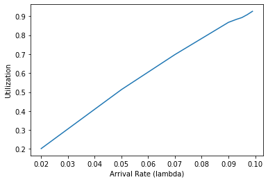
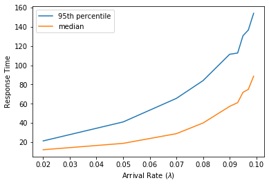
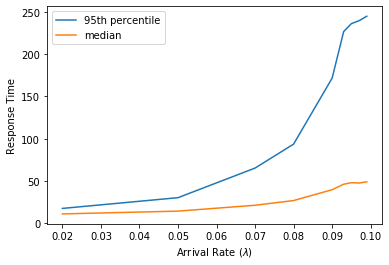
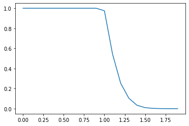

<div dir="rtl" style="text-align: justify;">

# گزارش تمرین گروهی ۲

گروه ۳
-----

عرشیا اخوان <letmemakenewone@gmail.com>

محمدرضا عبدی <reza_abdi20@yahoo.com>

احمد سلیمی <ahsa9978@gmail.com> 

امیرمهدی نامجو <amirm137878@gmail.com> 

ساعت زنگ‌دار
====================

در این بخش تغییر جدی نسبت به طراحی اولیه نداشتیم و تقریبا براساس همان توضیحات پیاده‌سازی را انجام دادیم.

به این شکل که یک مولفه به نام
`alarm_time`
به ریسه‌ها اضافه کردیم که زمان بیدار‌ شدن آن ها را مشخص می‌کند و یک لیست مرتب هم به نام
`sleepers`
برای ریسه‌های خوابیده داریم.

در تابع
`thread_sleep`
زمان مد نظر برای بیدار شدن را در 
`alarm_time`
مشخص کرده و در تابع
`thread_tick`
با جلو رفتن زمان، چک می‌کنیم که کدام ریسه‌ها را باید بیدار کنیم.

صرفا نیازی به
`sleepers_lock`
که در مستند اولیه نوشته بودیم، پیدا نکردیم و آن را در پیاده‌سازی استفاده نکردیم، زیرا با غیرفعال کردن وقفه‌ها عملا مشکل شرایط مسابقه‌ای پیش نمی‌آید.


زمان‌بند اولویت‌دار
====================

در مستند اولیه، برای طراحی
‍`conditional variable`
ها نکته خاصی در نظر نگرفته بودیم اما در پیاده‌سازی نیاز به تغییر آن‌ها هم پیدا کردیم تا لیست سمافورهای آن‌ها به ترتیب اولویت باشد. در نتیجه
به
`semaphore_elem`
مولفه
`priority`
را هم اضافه کردیم که  در تابع
`cond_wait`
مقداردهی می‌شود. (برابر با اولویت ریسه‌ای که روی آن متغیر شرطی صبر کرده)

شیوه کارکرد آن به این صورت است که هر ریسه‌ای که تلاش کند روی متغیر شرطی صبر کند، یک سمافور وارد لیست مربوطه که به صورت مرتب شده‌است می‌کند. در هنگامی که قصد بیدار کردن (سیگنال دادن) به یکی از ریسه‌‌های منتظر را داشته باشیم، براساس اولویت سمافور‌ نظیر آن‌ها اقدام می‌کنیم.

<div dir="ltr">

```c
struct semaphore_elem {
   ...
   int priority;
   ...
};
```
</div>

در مورد سوال پرسیده‌ شده در هنگام تحویل مستند اولیه، پیرامون حفظ وضعیت مرتب لیست در هنگام تغییر اولویت، روش کار ما همان طور که در هنگام تحویل توضیح دادیم، به این صورت است که ابتدا ریسه را از فهرست حذف کرده و دوباره به آن به صورت مرتب شده اضافه می‌کنیم که وضعیت مرتب لیست حفظ شود. این کار در تابع
`thread_set_priority_on_given`
انجام می‌شود:


<div dir="ltr">

```c
list_remove (&cur->elem);
list_insert_ordered (&ready_list, &cur->elem, thread_priority_comparator, NULL);
```
</div>


همچنین در زمان‌هایی نظیر ساخت ریسه، تغییر اولویت (با یا بدون اهدا)،
`sema_up`
که باعث ایجاد یا تغییر اولویت ریسه‌ها می‌شوند، اولویت ریسه سر لیست (بالاترین اولویت) را با ریسه فعلی مقایسه می‌کنیم و اگر اولویت ریسه فعلی کمتر بود، آن را
واگذار
می‌کنیم (yield).

در سایر موارد و الگوریتم‌های اصلی، مطابق با مستند اولیه پیاده‌سازی را انجام دادیم.


آزمایشگاه زمان‌بندی
====================


## آزمایش ۱

<div dir="ltr">

SRTF:

```
0: Arrival of Task 12 (ready queue length = 1)
0: Run Task 12 for duration 2 (ready queue length = 0)
1: Arrival of Task 13 (ready queue length = 1)
2: Arrival of Task 14 (ready queue length = 2)
2: IO wait for Task 12 for duration 1
2: Run Task 14 for duration 1 (ready queue length = 1)
3: Arrival of Task 15 (ready queue length = 2)
3: Wakeup of Task 12 (ready queue length = 3)
3: IO wait for Task 14 for duration 2
3: Run Task 12 for duration 2 (ready queue length = 2)
5: Wakeup of Task 14 (ready queue length = 3)
5: Run Task 14 for duration 1 (ready queue length = 2)
6: Run Task 15 for duration 2 (ready queue length = 1)
8: Run Task 15 for duration 1 (ready queue length = 1)
9: Run Task 13 for duration 2 (ready queue length = 0)
11: Run Task 13 for duration 2 (ready queue length = 0)
13: Run Task 13 for duration 2 (ready queue length = 0)
15: Run Task 13 for duration 1 (ready queue length = 0)
16: Stop
```

MLFQ:

```
0: Arrival of Task 12 (ready queue length = 1)
0: Run Task 12 for duration 2 (ready queue length = 0)
1: Arrival of Task 13 (ready queue length = 1)
2: Arrival of Task 14 (ready queue length = 2)
2: IO wait for Task 12 for duration 1
2: Run Task 13 for duration 2 (ready queue length = 1)
3: Arrival of Task 15 (ready queue length = 2)
3: Wakeup of Task 12 (ready queue length = 3)
4: Run Task 14 for duration 1 (ready queue length = 3)
5: IO wait for Task 14 for duration 2
5: Run Task 15 for duration 2 (ready queue length = 2)
7: Wakeup of Task 14 (ready queue length = 3)
7: Run Task 12 for duration 2 (ready queue length = 3)
9: Run Task 14 for duration 1 (ready queue length = 2)
10: Run Task 13 for duration 4 (ready queue length = 1)
14: Run Task 15 for duration 1 (ready queue length = 1)
15: Run Task 13 for duration 1 (ready queue length = 0)
16: Stop
```

</div>


# آزمایش ۲

1. ابتدا تعاریف زیر را ارائه می‌کنیم.

    1. سیستم کاملا بسته: سیستمی که تعداد مشخصی فعالیت دارد، و با اتمام هر فعالیت، دقیقا یک فعالیت دیگر در صف قرار می‌گیرد. این حالت خیلی در دنیای واقعی رخ نمی‌دهد.

    1. سیستم بسته تعاملی: سیستمی که تعداد مشخصی فعالیت دارد، و با اتمام هر فعالیت، با توجه به بازخورد کاربر ممکن است تعداد فعالیت‌هایی کخ در صف موجود اند تغییر کند.

    1. سیستم باز: سیستمی که فعالیت‌های آن از جامعه‌ای نامحدود در صف قرار می‌گیرند و فعالیت‌ها به یکدیگر وابستگی ندارند.

    با توجه به این تعاریف که از کتاب
    [Notes on Operating Systems, Dror G. Feitelson, School of Computer Science and Engineering, The Hebrew University of Jerusalem, 2011](https://citeseerx.ist.psu.edu/viewdoc/download?doi=10.1.1.352.9209&rep=rep1&type=pdf)
    برداشته شده‌است، در می‌یابیم که سیستم توصیف شده در این آزمایش، یک سیستم باز است.

1. فاصله زمانی رسیدن دو فعالیت متوالی از یک توزیع نمایی می‌باشد. در نتیجه:
    <div style="text-align: center; background: white; padding: 10px">
    
    </div>

1. طبق تعریف بهره‌وری، داریم:
    <div style="text-align: center; background: white; padding: 10px">
    
    </div>

1. نمودار بهره‌وری بصورت زیر به طور خطی با نرخ رسیدن فعالیت‌ها تغییر می‌کند.
    <div style="text-align: center; background: white; padding">
    
    </div>

1. نمودار زمان پاسخ‌گویی بصورت زیر است.
    <div style="text-align: center; background: white; padding">
    
    </div>

1. در صورتی که از زمان‌بند 
SRTF
استفاده کنیم، نمودار زمان پاسخگویی بصورت زیر خواهد شد.
    <div style="text-align: center; background: white; padding">
    
    </div>
    همانطور که در این نمودار مشاهده می‌شود، میانه زمان پاسخگویی نسبت به حالت
    round robin
    کاهش یافته و صدک ۹۵ام آن نیز افزایش یافته. علت آن است که در زمان‌بند
    SRTF
    زمانی که فعالیت در حال اجرا واگذار می‌شود، زمان‌بند دوباره همان را انتخاب می‌کند. چرا که زمان باقی‌ماندهٔ آن از
    M
    کمتر است. در نتیجه این باعث می‌شود که میانهٔ زمان پاسخگویی کاهش یابد، اما انحراف معیار آن افزایش پیدا کند. در حالی که در حالت
    round robin،
    پس از واگذاری یک فعالیت، آن فعالیت به ته صف می‌رود.

1. بهره‌وری نزدیک به ۱۰۰٪ به این معنی است که پردازنده در هر لحظه در حال انجام یک خدمت است. در این حالت با کمبود منابع سیستم مواجه هستیم و در هر لحظه فعالیتی در صف موجود است. در نتیجه پردازنده گلوگاه سیستم است. با توجه به فرمول محاسبهٔ بهره‌وری، بهره‌وری نزدیک به یک نشان می‌دهد که یا نرخ ورود زیاد است، و یا نرخ خدمت‌رسانی کم است.

## آزمایش ۳

1. چون کلا دو فعالیت در سیستم موجود است و همچنین یک برنامه تا زمانی که یک فعالیت خود را تمام نکند، به سراغ فعالیت بعدی نمی‌رود.

1. چون این دو متغیر i.i.d
هستند، داریم:
    <div style="text-align: center; background: white; padding: 10px">
     T_1], P[S_1 < T_1] + P[S_1 > T_1] = 1 \Rightarrow P[S_1 < T_1] = 0.5"/>
    </div>

1. چون
m
عدد بزرگی است، حاصل
m
نمونه از توزیع یکسان، طبق قضیهٔ حد مرکزی از توزیع نرمال پیروی می‌کند.
    <div style="text-align: center; background: white; padding: 10px">
    
    </div>

1. طبق قضیهٔ حد مرکزی هر دو
CPUTime
از توزیع نرمال با میانگین و واریانس بالا پیروی می‌کنند. در نتیجه داریم:
    <div style="text-align: center; background: white; padding: 10px">
    
    <br>
    <br>
    
    <br>
    <br>
    
    <br>
    <br>
     0]\\ &= P[Z > \frac{-E[S_i](1  - \alpha)}{\sqrt{Var(S_i) (1 + \alpha ^ 2)}}]\\ &= 1 - \Phi(\frac{-E[S_i](1  - \alpha)}{\sqrt{Var(S_i) (1 + \alpha ^ 2)}})\end{align*}"/>
    </div>

1. بصورت زیر محاسبه می‌کنیم.
    <div style="text-align: center; background: white; padding: 10px">
    
    <br>
    <br>
    
    </div>

    همانطور که مشاهده می‌شود، این محاسبات مستقل از
    m
    است و در نتیجه تغییری ایجاد نمی‌شود.
    درمورد رعایت عدالت، با توجه به این که احتمال این که یکی از برنامه ها، حداقل بیش از ۱۰ درصد از دیگری، از
    CPU
    استفاده کرده‌است، حدود ۵۲ درصد است، و این مقدار به طور قابل توجهی از ۵۰ درصد بیشتر است، در نتیجه این زمان‌بند عدالت را رعایت نکرده است و بهنام اشتباه می‌کرده است.

1. فعالیت‌ها را بصورت نمایی ایجاد می‌کنیم، سپس تعداد فعالیت‌هایی که در آن‌ها عدالت رعایت نشده است را با استفاده از آلفا می‌شماریم. سپس نسبت تعداد فعالیت‌های
unfair
به کل فعالیت‌ها را گزارش می‌کنیم. همانطور که مشاهده می‌شود، این مقدار به مقدار محاسبه شده توسط فرمول نزدیک است. بدیهی است که نمودار این نسبت، بر حسب آلفا بصورت نمودار تجمعی توزیع نرمال می‌باشد.
    <div style="text-align: center; background: white; padding">
    
    </div>


سوالات افزون بر طراحی
====================

- بیان کنید که هر فرد گروه دقیقا چه بخشی را انجام داد؟ آیا این کار را به صورت مناسب انجام دادید و چه کارهایی برای بهبود
عملکردتان می توانید انجام دهید.
  > همه کار ها به صورت جلسات ۴ نفره در
  vscode live share
   انجام شد و همه افراد گروه در تمام مسیر پیشرفت پروژه دخیل بوده‌اند.

- آیا کد شما مشکل بزرگی امنیتی در بخش حافظه دارد
(به طور خاص رشته‌ها در زبان C؟ )
memory leak
 و نحوه مدیریت ضعیف خطاها نیز بررسی خواهد شد.
  > برای مدیریت خطا‌ها در جاهایی که لازم بوده ASSERT گذاشته شده است. همچنین در توابعی که تغییر ایجاد کردیم، ASSERT های قبلی پیاده‌سازی خود PINTOS را حفظ کردیم.
  > در مورد Memory leak تقریبا در هیچ کدام از توابعی که تغییر دادیم، نیازی به گرفتن حافظه از طریق روش‌هایی نظیر malloc نبوده است و همه حافظه‌ها، متغیرهای محلی توابع بوده‌اند که بعد از اتمام تابع از پشته خارج می‌شوند. در نتیجه Memory Leak نداریم.
  
- آیا از یک Style Code واحد استفاده کردید؟ آیا style مورد استفاده توسط شما با pintos هم خوانی دارد؟(از نظر
فرورفتگی و نحوه نام گذاری)

  > بله

- آیا کد شما ساده و قابل درک است؟

  > بله، تلاش کرده‌ایم تا سطح سادگی و قابل فهم بودن کد در تمام کدبیس 
  pintos
  یکسان باشد.

- آیا کد پیچیده ای در بخشی از کدهای خود دارید؟ در صورت وجود آیا با قرار دادن توضیحات مناسب آن را قابل فهم کردید؟

  > خیر

- آیا کد Comment شده ای در کد نهایی خود دارید؟
آیا کدی دارید که کپی کرده باشید؟

  > خیر

- آیا الگوریتم های list linked را خودتان پیاده سازی کردید یا از پیاده سازی موجود استفاده کردید؟

  > خیر، از پیاده‌سازی موجود استفاده کردیم.

- آیا طول خط کدهای شما بیش از حد زیاد است؟ (۱۰۰ کاراکتر)

  > خیر

- آیا در git خودتان پرونده های binary حضور دارند؟(پرونده های binary و پرونده های log را commit نکنید!)
  > خیر
</div>